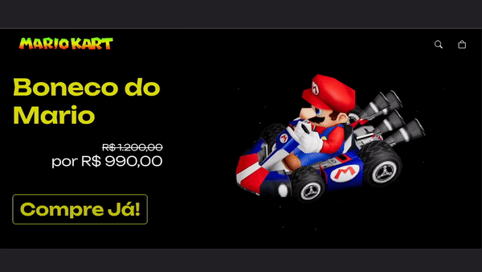

# 3D Store: Mario Kart

> Página de produto de simulação para uma loja de produtos 3D



## 🚀 Configuração do sistema

1. Abra o terminal na raíz do projeto e instale as dependencias:
```bash
npm install
```
ou
```bash
yarn
```

2. Inicie o projeto:
```bash
npm start
```
ou
```bash
yarn start
```

# 💻 Tecnologias Utilizadas

* ReactJS
* ThreeJS
* Modelo 3D do Mario Kart
* Styled Components

## 🤝 Colaboradores

<table>
  <tr>
    <td align="center">
      <a href="#">
        <br>
        <sub>
          <b>Vinícius Gabriel</b>
        </sub>
      </a>
    </td>
  </tr>
</table>
